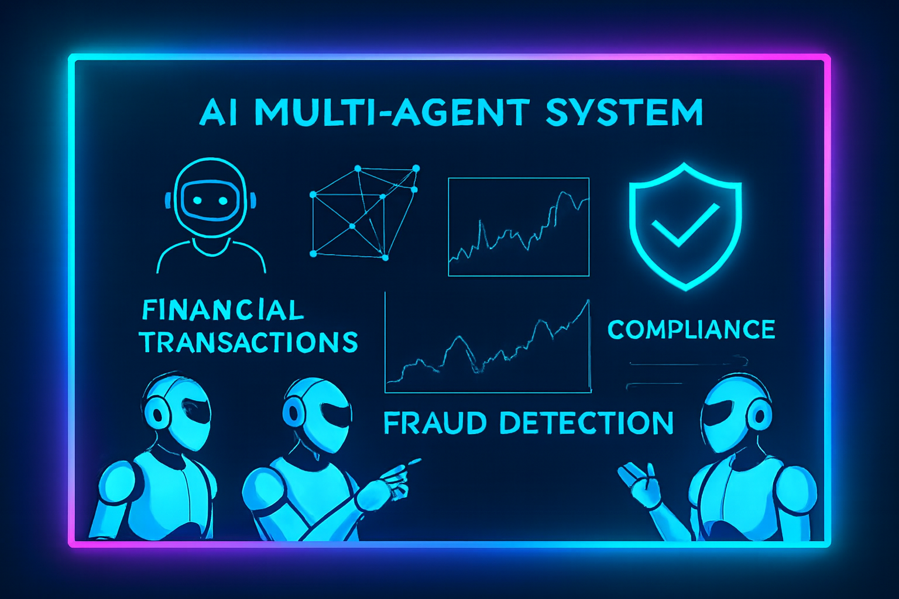

# 

# Production AI Banking Assistant (LangGraph + Snowflake)

A production-inspired AI Banking Assistant built to learn modern AI Engineering concepts by implementing them incrementally using LangGraph, Snowflake, OpenAI, and Retrieval-Augmented Generation (RAG).

This project focuses on understanding how enterprise AI assistants are designed—from SQL agents and conversation memory to vector databases, multi-agent workflows, and production-ready architecture.

> **Project Status:** 🚧 In Progress

---

## Project Goals

The primary objective of this project is to gain hands-on experience with real-world AI Engineering concepts by building one production-style application step by step.

Each phase introduces a single concept while keeping the implementation clean, modular, and beginner-friendly.

Topics covered include:

* AI Agent Architecture
* LangGraph Workflows
* Tool Calling
* Conversation Memory
* Retrieval-Augmented Generation (RAG)
* Vector Databases
* Multi-Agent Systems
* Production Project Structure
* Snowflake Integration
* LLM Application Development

---

## Tech Stack

* Python
* LangGraph
* LangChain
* OpenAI GPT Models
* OpenAI Embeddings
* Snowflake Snowpark
* Chroma Vector Database
* Pandas
* python-dotenv

---

## Banking Dataset

The project uses a simplified banking data warehouse stored in Snowflake.

### Customer

* CUSTOMER_ID
* FIRST_NAME
* LAST_NAME
* AGE
* COUNTRY

### Account

* ACCOUNT_ID
* CUSTOMER_ID
* ACCOUNT_TYPE
* BALANCE

### Merchant

* MERCHANT_ID
* MERCHANT_NAME
* CATEGORY
* RISK_SCORE

### Transactions

* TRANSACTION_ID
* CUSTOMER_ID
* ACCOUNT_ID
* MERCHANT_ID
* AMOUNT
* IS_FRAUD

---

## System Architecture

```
User
   │
   ▼
Manager Agent
   │
   ├── SQL Tool (Snowflake)
   ├── RAG Tool (Chroma)
   └── Calculator Tool (Python)
   │
   ▼
Fraud Analyst Agent
   │
   ▼
Conversation Memory
(LangGraph MemorySaver)
   │
   ▼
Final Response
```

---

## Core Components

### SQL Tool

* Executes SQL queries on Snowflake
* Retrieves structured banking data
* Returns formatted results to the agent

### RAG Tool

* Searches embedded banking documents
* Retrieves relevant context using Chroma
* Supports policy and documentation queries

### Calculator Tool

* Performs arithmetic and statistical calculations
* Avoids unnecessary LLM computations

### Manager Agent

* Understands user intent
* Chooses the appropriate tool or agent
* Combines results into a single response

### Fraud Analyst Agent

* Analyzes customers, merchants, and transactions
* Explains fraud indicators in natural language
* Relies on retrieved data rather than executing SQL directly

---

## Conversation Memory

The assistant uses **LangGraph MemorySaver** to maintain conversation context.

Example:

```
User:
Show customer C001.

Assistant:
Displays customer details.

User:
What is his balance?

Assistant:
Understands that "his" refers to customer C001.
```

---

## Retrieval-Augmented Generation (RAG)

Structured banking data is queried directly from Snowflake.

Unstructured knowledge is retrieved using Chroma vector search.

Planned knowledge sources include:

* Fraud Policy
* KYC Policy
* AML Guidelines
* Banking SOPs

---

## Learning Roadmap

* ✅ Phase 1 – Snowflake Connection & LLM
* ✅ Phase 2 – SQL Tool
* ✅ Phase 3 – LangGraph Workflow
* ✅ Phase 4 – Conversation Memory
* ⏳ Phase 5 – OpenAI Embeddings
* ⏳ Phase 6 – Chroma Vector Database
* ⏳ Phase 7 – Retrieval-Augmented Generation (RAG)
* ⏳ Phase 8 – Manager Agent
* ⏳ Phase 9 – Fraud Analyst Agent
* ⏳ Phase 10 – Complete Multi-Agent Banking Assistant

---

## Learning Approach

Each phase is designed to:

* Introduce one new AI Engineering concept
* Keep the implementation simple and production-oriented
* Reuse existing components where possible
* Maintain clean architecture and separation of concerns
* Ensure the project is fully runnable before moving to the next phase

---

## Future Enhancements

* Streaming responses
* Human-in-the-loop workflows
* Multi-LLM support
* Observability with LangSmith
* Agent evaluation framework
* Authentication & role-based access
* Deployment with Docker and cloud services
* CI/CD pipeline
* Monitoring and logging

---

## Repository Status

🚧 This project is actively under development.

New phases and features will be added as the learning journey progresses.

Stay tuned!


